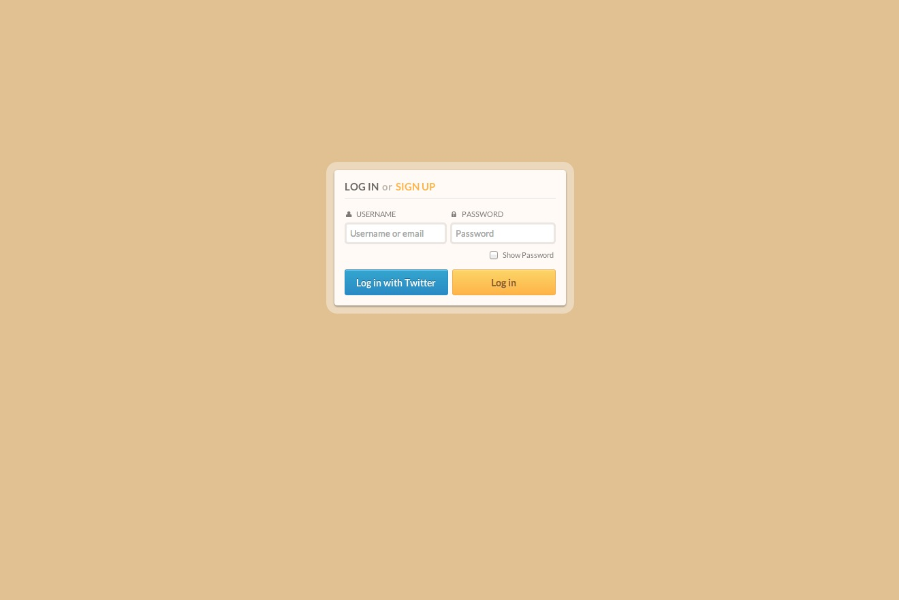
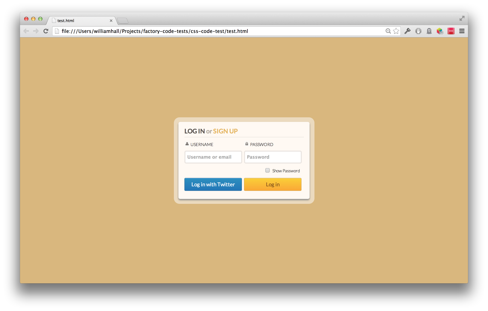

# HTML and CSS Technical Test

The task was to create a login box with HTML and CSS as close to the `example.jpg` as is reasonable.

I was quite happy with my result for this task. There are a few more small differences between the example and the result, but in general I feel it is a very close match. I started off be noting down the colours of each part of the example and taking some measurements to work to. 

The font was already provided for the task, however the padlock and user icons were not, in this case I took a copy of the images from the example. If I was not working to an example I would probably have found an icon online for this, perhaps from a bootstrap template.

Technologies used
----
-HTML5
-CSS3

How to run it
----
```sh
cd css-code-test
open test.html
```

### Example



### Result
