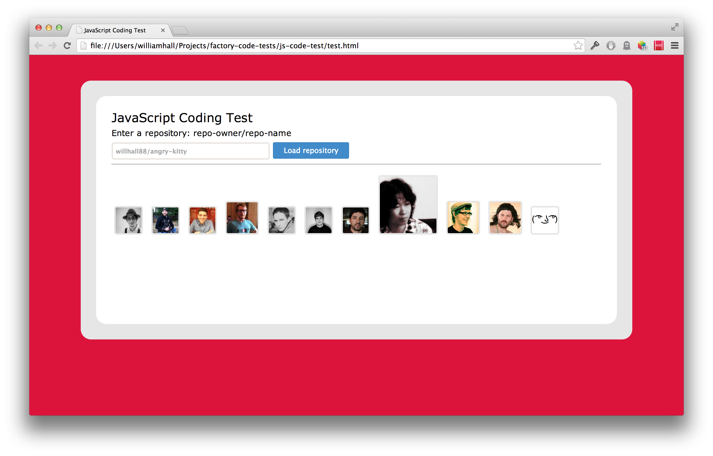

# JavaScript Technical Test

The challenge of this test was to make an AJAX request to Github to get the last 20 commits for a certain repository, then add the avatars of the committers to the `#content` div.

The more commits they have made, the bigger the avatar should be. For example:

* 1 commit, 50px x 50px 
* 2 commits, 60px x 60px 
* 3 commits, 70px x 70px 
* ...

I started this task by writing some simple Javascript without testing to see what information was returned from the AJAX request to Github. I quickly wrote a function to add the avatars for the last 20 commits. From this point I could see what output I could get without much manipulating of the data. The output avatars were not a set size and multiple commits by the same user meant their avatar appeared multiple times. 

I then started writing some Jasmine tests to manipulate the data supplied from the Github API. I pulled the data I deemed necessary to the task (commiter ID and avatar) and then calculated the number of commits each user had made. Once I had got these tests to pass it was a case of linking this up to the AJAX request and adjusting each avatar to the correct size. 

I did not write a test to check the correct size of each avatar, as I could not get my custom matcher to work in this instance, and I could easily test this visually by loading up the page.

When it came to setting the size of the avatars I would have preferred to have given the avatar an ID with some CSS assigned to this ID, however I decided against this and just assigning the width and height individually for each avatar. The reason I chose this was because there would have to be multiple size ID's and could create some edge cases if the commit count rose above the largest size ID. Instead the size of the avatar is more dynamic and directly linked to the number of commits.


Technologies used
----
- Javascript
- jQuery
- Jasmine
- AJAX
- Git
- Github API

How to run it
----
```sh
cd js-code-test
open test.html
```

How to run unit tests
----
```sh
cd js-code-test
open SpecRunner.html
```

Result:


